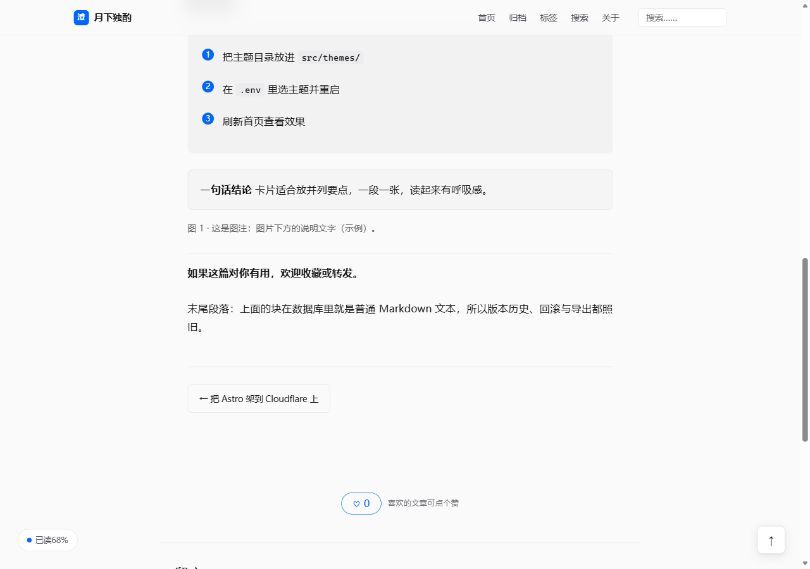
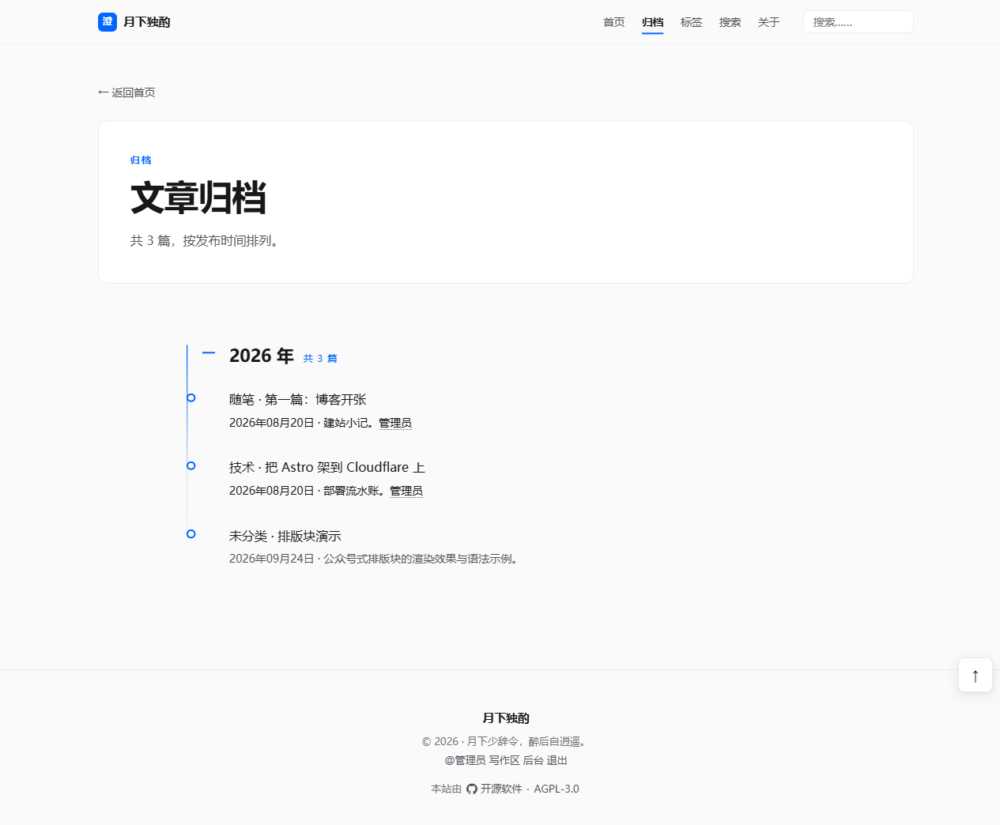
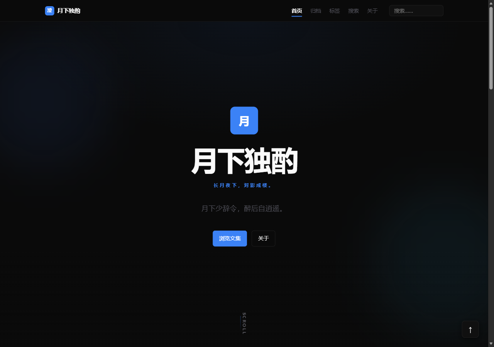

# Clarity 澄明

> 移植自班务平台（class-feedback）的现代极简主题——Vercel 式克制层级 + Linear 式状态点 + Apple 式半透明材质，冷灰底配蓝色强调，亮暗双模式跟随系统。


## 特性

- **Vercel 式克制层级**：以 1px border 分隔、几乎不用投影，标题负字距、数字 tabular-nums
- **Linear 式状态点**：归档时间线以细线与空心圆点串联，列表元信息克制
- **Apple 式半透明材质导航**：`backdrop-filter` 毛玻璃吸顶导航
- **单强调色系统**：蓝色 `#0066ff`（暗色 `#3b82f6`）承担全部「高亮/可点击」语义，其余为中性灰阶；4 基数间距、6/8/12 圆角
- **emil 标准动效**：`--ease-out` 强自定义曲线，进入为 translateY + fade，按钮按下 160ms scale(0.97)
- **亮/暗双模式**：`prefers-color-scheme` 跟随系统，令牌双套
- 覆盖全部 10 个核心模板 + BaseLayout + TagResults 覆盖；认证五页回退 classic
- 承接契约能力：多作者署名、全文样式预设（layout）、排版块锚点、评论/分页/点赞回退组件按令牌换肤
- 双语词典（zh-CN / en），语态现代、直接





暗色模式：



## 安装

```bash
# 博客主仓库内
pnpm theme:add clarity
pnpm theme clarity
```

或直装 zip：`pnpm theme:add ./clarity.zip`

## 契约

engine_version: **1** · 基于 classic 全量模板改写 · 认证页回退 classic

## 许可证

AGPL-3.0-or-later

## 更新日志

### 1.0.1
- 卡片结构改造：卡片容器由整卡 `<a>` 改为 `<div>`，标题以核心 `CardLink`（`::after` 铺满整卡）承接点击，消除「卡内署名链接」造成的 `<a>` 嵌套；作者页卡片一并统一
- 归档/列表卡片焦点环改由 CardLink 提供；补 `.tl-item:hover .tl-event` 与署名浮层 `z-index`
- 文章页阅读进度胶囊与返回顶部浮钮统一对齐（24px / 移动端 16px + safe-area）

### 1.0.0
- 首个版本：移植班务平台 class-feedback 的设计语言到博客主题（tokens 沿用 classic 变量名，仅替换取值与视觉语汇）
